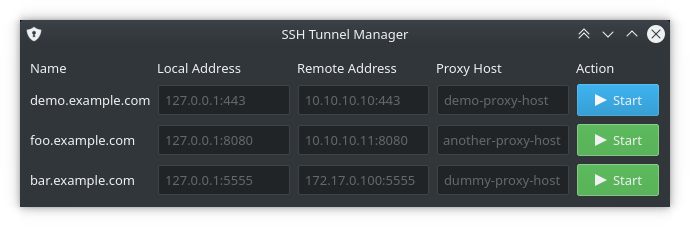

# SSH Tunnel Manager

A PyQt GUI to manage SSH tunnels



## Usage

* Install dependencies: `pip3 install PyQt5`
* Create a config: `cp config.example.json config.json`
* Run the app: `python3 app.py`
* You can modify `sshtunnelmgr.desktop` and put in `~/.local/share/application` to create a app menu shortcut

## Configuration

A sample configuration file provide as `config.example.json`. Here is one sample host entry.

```json
{
  "kubernetes": {
    "remote_address": "10.10.10.11:30000",
    "local_port": 30000,
    "proxy_host": "another-proxy-host",
    "browser_open": "http://127.0.0.1"
  }
}
```

This entry, when clicked `Start`, will run the following SSH command to establish the tunnel.

```
ssh -L 10.10.10.11:30000:127.0.0.1:30000 dummy-proxy-host
```

The key `browser_open` is optional. If provided, it will open the provided URL in the system's default web browser. (The `local_port` will be appended to the URL automatically!)

The application saves the tunnel information into a `dict` and can `kill` it when the `Stop` button is clicked.

> WARNING: To allow SSH to bind on privileged ports, run `sudo setcap CAP_NET_BIND_SERVICE=+eip /usr/bin/ssh`

## Icons

If you put image files (png/jpg/bmp) in `./icons/` with the same filename as the `name` of tunnel, it will appear as icon for that specific entry.

For example, the tunnel identifier is `kubernetes`, so `./icons/kubernetes.png` will be set as the form's icon.

## Migration

If you are migrating from older versions of this tool, please change all `local_address` in your config to `local_port` and make it a number.

## TODO

* Gracefully close SSH session instead of `kill`
* Allow adding/editing/deleting hosts using the GUI
* Store the config in `QSettings` instead of local JSON file
